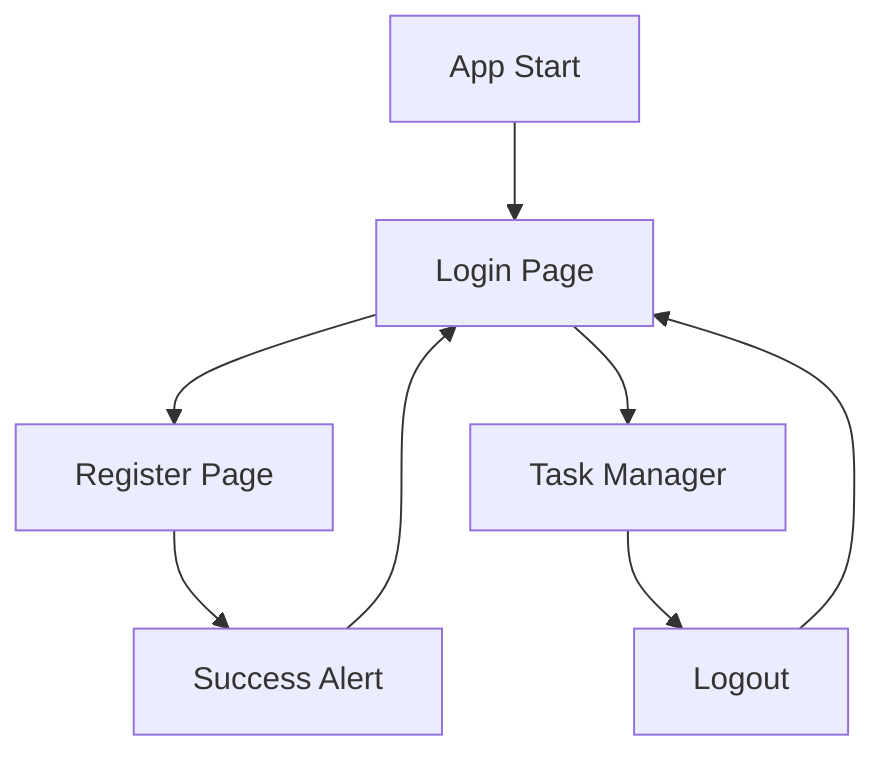

# 🔐 Simplified Authentication Flow

## ✅ Implemented Authentication Flow

Your Task Manager now has the **exact** simple authentication flow you requested:

### 🚀 App Startup
1. **Always starts with Login Page** (no auto-login complexity)
2. Clean, simple interface with login form

### 👤 User Flows

#### **New User Flow:**
```
App Start → Login Page → Click "Register" → Registration Page 
    ↓
Fill Details → Click "Register" → Success Alert → Login Page 
    ↓
Enter Credentials → Click "Login" → Task Manager Page
```

#### **Existing User Flow:**
```
App Start → Login Page → Enter Credentials → Click "Login" → Task Manager Page
```

## 🎯 Key Features

### ✅ **Simple & Direct**
- **Register Button** → Always redirects to Login Page
- **Login Button** → Always goes directly to Task Manager Page
- No complex auto-login or session management
- Clean, intuitive user interface

### ✅ **User Experience**
- Clear visual feedback with loading indicators
- Consistent styling between Login and Register screens
- Helpful error messages for invalid inputs
- Easy navigation between Login and Register

### ✅ **Security**
- JWT token storage for session management
- Secure password handling
- Input validation on both frontend and backend
- Clean logout functionality

## 🎨 Visual Design

### **Login Screen**
- **Title**: "Welcome to Task Manager"
- **Subtitle**: "Please login to continue"
- **Blue Login Button**: Direct to Task Manager
- **Register Link**: Navigate to Registration

### **Register Screen**
- **Title**: "Create New Account"  
- **Subtitle**: "Join Task Manager today"
- **Green Register Button**: Redirect to Login Page
- **Login Link**: Return to Login Screen

### **Navigation**
- Professional blue headers for internal screens
- No back button on Task Manager (prevents accidental logout)
- Clear navigation hierarchy

## 🧪 Testing the Flow

### **Test New User Registration:**
1. Open app → Should see Login Page
2. Click "Register" → Should go to Registration Page
3. Fill in: Name, Email, Password → Click "Register"
4. Should see success alert → Click "OK" → Back to Login Page
5. Enter same email/password → Click "Login" → Should go to Task Manager

### **Test Existing User Login:**
1. Open app → Should see Login Page
2. Enter email/password → Click "Login" → Should go directly to Task Manager
3. Use all task features (add, edit, delete, filter)
4. Click "Logout" → Should return to Login Page

## 📱 Demo Script (2 Minutes)

**0:00-0:20 - App Introduction**
- Show Login page on startup
- Explain the simple two-screen authentication

**0:20-0:50 - New User Registration**
- Click "Register" → Show registration form
- Fill details (John Doe, john@example.com, password123)
- Click "Register" → Show success alert and redirect to Login

**0:50-1:20 - Login and Task Management**
- Enter credentials → Click "Login" → Show Task Manager
- Quickly demonstrate: Add task, mark complete, delete task

**1:20-1:50 - User Flow Demonstration**
- Logout → Return to Login page
- Login again → Direct to Task Manager
- Show filtering features (All/Pending/Completed)

**1:50-2:00 - Conclusion**
- Summarize simple flow
- Show it works on both web and mobile

## 🔄 Complete Flow Summary



## ✅ Requirements Fulfilled

- ✅ **App starts with Login Page** (always)
- ✅ **Register Button** → Redirect to Login Page
- ✅ **Login Button** → Go directly to Task Manager Page
- ✅ **Simple and intuitive** user experience
- ✅ **Professional styling** and consistent design
- ✅ **Proper error handling** and validation
- ✅ **Cross-platform support** (Web + Mobile)

---

**🎉 Your Task Manager now has the exact simple authentication flow you requested!**

### Quick Commands to Run:
```bash
# Backend (Terminal 1)
cd task-manager-backend
npm run test-local

# Frontend (Terminal 2) 
cd task-manager-frontend
npm start

# Then open: http://localhost:8081
```

The app will start with the Login page, and follow your exact flow requirements!